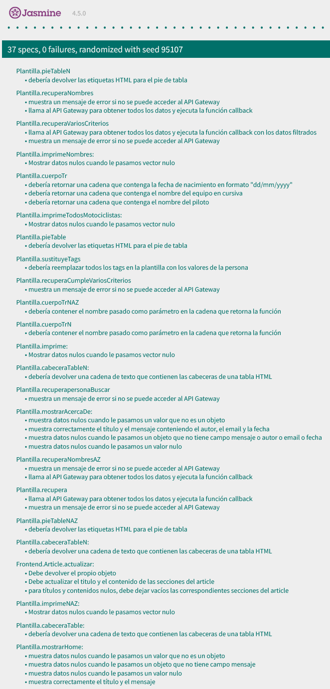
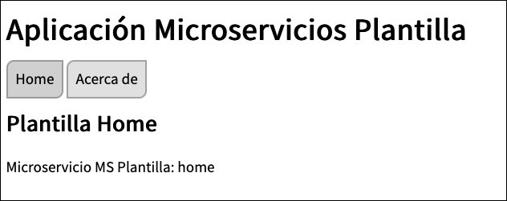

[](https://classroom.github.com/a/hneiFYl3)
[](https://classroom.github.com/online_ide?assignment_repo_id=10504148&assignment_repo_type=AssignmentRepo)
# *Datos Estudiante*

Nombre: Irene 

Apellidos: Rubiales Argüelles

Correo Electronico: ira00026@red.ujaen.es

Deporte: Motociclismo

Enlace tablero Trello: https://trello.com/invite/b/aN7DSvZt/ATTIe794db3800929c0b30816f60942973c0218CBFAF/practica-3

## Los campos elegidos para realizar la base de datos son:

**-	CAMPOS TIPO NOMBRE:**

•	Nombre: El nombre del piloto.

•	Nombre del equipo: Un campo de nombre que indica el nombre del equipo al que pertenece el piloto.

•	Tipo de moto: El modelo de motocicleta que utiliza el piloto en las carreras.


**-	CAMPOS TIPO COMPUESTO:**

•	Fecha de nacimiento del piloto: Compuesto por un campo día, mes y año.


**-	CAMPOS TIPO VECTOR:**

•	Años de experiencia del piloto: Un vector que contiene los años en los que el piloto ha competido en carreras de motociclismo.

•	Puntuaciones en cada carrera: Un campo vector que incluye la puntuación obtenida por el piloto en cada carrera disputada en una 	temporada.

•	Marcas de motocicletas utilizadas: (campo de tipo vector que enumera las marcas de motocicletas que ha utilizado el piloto a lo 	largo de su carrera, por ejemplo: [Honda, Yamaha, Ducati])


**-	CAMPOS TIPO NUMÉRICO:**

•	Posición en el campeonato: Un campo numérico que indica la posición que ocupa el piloto en la clasificación del campeonato.


## Captura "home" de Fauna:


# Captura "Coleccion" de Fauna:


# Captura "Documentos" de Fauna:


## DOCUMENTOS (En formato JSON):

**Documento 1:**

```
{
  "nombre": "Jorge Lorenzo",
  "nombre_equipo": "Yamaha Factory Racing",
  "tipo_moto": "Yamaha YZR-M1",
  "fecha_nacimiento": {
    "dia": 4,
    "mes": 5,
    "anio": 1987
  },
  "anios_experiencia": [2002, 2003, 2004, 2005, 2006, 2007, 2008, 2009, 2010, 2011, 2012, 2013, 2014, 2015, 2016, 2017, 2018, 2019],
  "puntuaciones_carrera": [25, 20, 16, 13, 11, 10, 9, 8, 7, 6, 5, 4, 3, 2, 1, 0, 0, 0],
  "marcas_motocicletas": ["Aprilia", "Honda", "Yamaha", "Ducati"],
  "posicion_campeonato": 7
}


```

**Documento 2:**

```
{
  "nombre": "Valentino Rossi",
  "nombre_equipo": "Monster Energy Yamaha MotoGP",
  "tipo_moto": "Yamaha YZR-M1",
  "fecha_nacimiento": {
    "dia": 16,
    "mes": 2,
    "anio": 1979
  },
  "anios_experiencia": [1996, 1997, 1998, 1999, 2000, 2001, 2002, 2003, 2004, 2005, 2006, 2007, 2008, 2009, 2010, 2011, 2012, 2013, 2014, 2015, 2016, 2017, 2018, 2019, 2020, 2021],
  "puntuaciones_carrera": [25, 20, 16, 13, 11, 10, 9, 8, 7, 6, 5, 4, 3, 2, 1, 0, 0, 0, 0, 0, 0, 0, 0, 0, 0, 0],
  "marcas_motocicletas": ["Aprilia", "Honda", "Yamaha", "Ducati"],
  "posicion_campeonato": 10
}

```

**Documento 3:**

```
{
  "nombre": "Marc Márquez",
  "nombre_equipo": "Repsol Honda Team",
  "tipo_moto": "Honda RC213V",
  "fecha_nacimiento": {
    "dia": 17,
    "mes": 2,
    "anio": 1993
  },
  "anios_experiencia": [2008, 2009, 2010, 2011, 2012, 2013, 2014, 2015, 2016, 2017, 2018, 2019, 2020, 2021],
  "puntuaciones_carrera": [25, 20, 16, 13, 11, 10, 9, 8, 7, 6, 5, 4, 3, 2, 1, 0, 0, 0, 0, 0, 0, 0, 0, 0, 0],
  "marcas_motocicletas": ["KTM", "Honda"],
  "posicion_campeonato": 5
}

```

**Documento 4:**

```
{
  "nombre": "Joan Mir",
  "nombre_equipo": "Team Suzuki Ecstar",
  "tipo_moto": "Suzuki GSX-RR",
  "fecha_nacimiento": {
    "dia": 1,
    "mes": 9,
    "anio": 1997
  },
  "anios_experiencia": [2015, 2016, 2017, 2018, 2019, 2020, 2021],
  "puntuaciones_carrera": [25, 20, 16, 13, 11, 10, 9],
  "marcas_motocicletas": ["KTM", "Suzuki"],
  "posicion_campeonato": 1
}

```

**Documento 5:**

```
{
  "nombre": "Maverick Viñales",
  "nombre_equipo": "Monster Energy Yamaha MotoGP",
  "tipo_moto": "Yamaha YZR-M1",
  "fecha_nacimiento": {
    "dia": 12,
    "mes": 1,
    "anio": 1995
  },
  "anios_experiencia": [2011, 2012, 2013, 2014, 2015, 2016, 2017, 2018, 2019, 2020, 2021],
  "puntuaciones_carrera": [25, 20, 16, 13, 11, 10, 9, 8, 7, 6, 5, 4, 3, 2, 1, 0, 0, 0, 0, 0],
  "marcas_motocicletas": ["Suzuki", "Yamaha"],
  "posicion_campeonato": 9
}

```

**Documento 6:**

```
{
  "nombre": "Fabio Quartararo",
  "nombre_equipo": "Monster Energy Yamaha MotoGP",
  "tipo_moto": "Yamaha YZR-M1",
  "fecha_nacimiento": {
    "dia": 20,
    "mes": 4,
    "anio": 1999
  },
  "anios_experiencia": [2019, 2020, 2021],
  "puntuaciones_carrera": [25, 20, 16, 13, 11, 10, 9, 8, 7, 6, 5, 4, 3, 2, 1, 0, 0, 0, 0, 0, 0, 0, 0, 0, 0],
  "marcas_motocicletas": ["Yamaha"],
  "posicion_campeonato": 2
}

```

**Documento 7:**

```
{
  "nombre": "Johann Zarco",
  "nombre_equipo": "Pramac Racing",
  "tipo_moto": "Ducati Desmosedici GP",
  "fecha_nacimiento": {
    "dia": 16,
    "mes": 7,
    "anio": 1990
  },
  "anios_experiencia": [2012, 2013, 2014, 2015, 2016, 2017, 2018, 2019, 2020, 2021],
  "puntuaciones_carrera": [25, 20, 16, 13, 11, 10, 9, 8, 7, 6, 5, 4, 3, 2, 1, 0, 0, 0, 0, 0, 0, 0, 0, 0, 0],
  "marcas_motocicletas": ["Yamaha", "Honda", "Ducati"],
  "posicion_campeonato": 7
}

```

**Documento 8:**

```
{
  "nombre": "Alex Rins",
  "nombre_equipo":  "Team Suzuki Ecstar",
  "tipo_moto": " Suzuki GSX-RR",
  "fecha_nacimiento": {
    "dia": 8,
    "mes": 12,
    "anio": 1995
  },
  "anios_experiencia": [2015, 2016, 2017, 2018, 2019, 2020, 2021],
  "puntuaciones_carrera": [25, 20, 16, 13, 11, 10, 9, 8, 7, 6, 5, 4, 3, 2, 1, 0, 0, 0, 0, 0, 0, 0, 0, 0, 0],
  "marcas_motocicletas": ["Suzuki", "Yamaha", "Aprilia"],
  "posicion_campeonato": 11
}

```

**Documento 9:**

```
{
  "nombre": "Enea Bastianini",
  "nombre_equipo": "Avintia Esponsorama Racing",
  "tipo_moto": "Ducati Desmosedici GP",
  "fecha_nacimiento": {
    "dia": 30,
    "mes": 12,
    "anio": 1997
  },
  "anios_experiencia": [2020, 2021],
  "puntuaciones_carrera": [25, 20, 16, 13, 11, 10, 9, 8, 7, 6, 5, 4, 3, 2, 1, 0, 0, 0, 0, 0, 0, 0, 0, 0, 0],
  "marcas_motocicletas": ["Ducati"],
  "posicion_campeonato": 16
}

```

**Documento 10:**

```
{
  "nombre": "Iker Lecuona",
  "nombre_equipo": "Tech 3 KTM Factory Racing",
  "tipo_moto": "KTM RC16",
  "fecha_nacimiento": {
    "dia": 6,
    "mes": 1,
    "anio": 2000
  },
  "anios_experiencia": [2020, 2021],
  "puntuaciones_carrera": [25, 20, 16, 13, 11, 10, 9, 8, 7, 6, 5, 4, 3, 2, 1, 0, 0, 0, 0, 0, 0, 0, 0, 0, 0],
  "marcas_motocicletas": ["KTM"],
  "posicion_campeonato": 21
}

```

## Captura TRELLO al inicio "BACKLOG":
* Las historias de usuario se aagruparán en INCREMENTOS, cada incremento debe de estar compuesto (como míinimo) de 3 historias de usuario. Los incrementos del desarrollo de mi aplicación de microservicios del deporte de "Motocilismo", consta de los siguientes incrementos: 
* Incremento 1: Historias de usuario 01,02,03,04
* Incremento 2 : Hisotrias de usuario 08,10,11


## Historias de usuario elegidas a implementar en mi aplicación de microservicios: 

## Captura TRELLO primer incremento en "Implementación de código":


## HU 01:Ver la información del autor/autora de la aplicación al pulsar en el botón “Acerca de”.

* En el fichero callbacks.js:
```
    acercaDe: async (req, res) => {
        try {
            CORS(res).status(200).json({
                mensaje: "Microservicio MS Plantilla: acerca de",
                autor: "Irene Rubiales Arguelles",
                email: "ira00026@red.ujaen.es",
                fecha: "Marzo 2023"
            });
        } catch (error) {
            CORS(res).status(500).json({ error: error.description })
        }
    },

}

```

## Captura "HU 02":


## HU 02:
02. Ver un listado solo con los nombres de todos los jugadores/equipos.
* Para esta HU, he implementado el método : "getNombres".


```
getNombres: async (req, res) => {
    try {
        let motociclistas = await client.query(
            q.Map(
                q.Paginate(q.Documents(q.Collection(COLLECTION))),
                q.Lambda("X", q.Select(["data", "nombre"], q.Get(q.Var("X"))))
            )
        )
        
        CORS(res)
            .status(200)
            .json(motociclistas)
    } catch (error) {
        CORS(res).status(500).json({ error: error.description })
    }
},

```
```
router.get("/getNombres", async (req, res) => {
    try {
        await callbacks.getNombres(req, res)
    } catch (error) {
        console.log(error);
    }
});
```

* Compuesto de las funciones: recuperaNombres, imprimeNombres, cabeceraTableN, cuerpoTrN, pieTableN, listarNombres

```

Plantilla.recuperaNombres = async function (callBackFn) {
    let response = null

    // Intento conectar con el microservicio Plantilla
    try {
        const url = Frontend.API_GATEWAY + "/plantilla/getNombres"
        response = await fetch(url)

    } catch (error) {
        alert("Error: No se han podido acceder al API Gateway")
        console.error(error)
        //throw error
    }

    // Muestro todos los datos que se han descargado
    let vectorPlantilla = null
    if (response) {
        vectorPlantilla = await response.json()
        callBackFn(vectorPlantilla.data)
    }
}

```
```
Plantilla.imprimeNombres = function (vector) {
    //console.log( vector ) // Para comprobar lo que hay en vector
    let msj = "";
    msj += Plantilla.cabeceraTableN();
    vector.forEach(e => msj += Plantilla.cuerpoTrN(e))
    msj += Plantilla.pieTableN();

    // Borro toda la info de Article y la sustituyo por la que me interesa
    Frontend.Article.actualizar( "Listado de NOMBRES de motociclistas", msj )

}

```
```
Plantilla.cabeceraTableN = function () {
    return `<table class="listado-Plantilla">
        <thead>
        <th>Nombre</th>
        </thead>
        <tbody>
    `;
}

```
```
Plantilla.cuerpoTrN = function (nombre) {
   
    return `
    <tr">
    <td>${nombre}</td>

    </tr>
    `;
}
```

```
Plantilla.pieTableNAZ = function () {
    return "</tbody></table>";
}

```
```

Plantilla.listarNombres = function () {
  this.recuperaNombres(this.imprimeNombres);
}

```

## Captura "HU 02":


## HU 03:
03. Ver un listado solo con los nombres de todos los jugadores/equipos ordenados alfabéticamente. 
* Para esta HU, he implementado el método : "getNAlfabeticamente".

```
getNAlfabeticamente: async (req, res) => {
    try {
        let motociclistas = await client.query(
            q.Map(
                q.Paginate(q.Documents(q.Collection(COLLECTION))),
                q.Lambda("X", q.Select(["data", "nombre"], q.Get(q.Var("X"))))
            )
        )
        
        CORS(res)
            .status(200)
            .json(motociclistas)
    } catch (error) {
        CORS(res).status(500).json({ error: error.description })
    }
},
}

```
```
router.get("/getNAlfabeticamente", async (req, res) => {
    try {
        await callbacks.getNAlfabeticamente(req, res)
    } catch (error) {
        console.log(error);
    }
});

```

* Compuesto de las funciones: recuperaNombresAZ, imprimeNCompuesto de las funciones: recuperaNombres, imprimeNAZ, cabeceraTableNAZ, cuerpoTrNAZ, pieTableNAZ, listarNombresAZ

```

Plantilla.recuperaNombresAZ = async function (callBackFn) {
    let response = null

    // Intento conectar con el microservicio Plantilla
    try {
        const url = Frontend.API_GATEWAY + "/plantilla/getNAlfabeticamente"
        response = await fetch(url)

    } catch (error) {
        alert("Error: No se han podido acceder al API Gateway")
        console.error(error)
        //throw error
    }

    // Muestro todos los datos que se han descargado
    let vectorPlantilla = null
    if (response) {
        vectorPlantilla = await response.json()
        callBackFn(vectorPlantilla.data.sort())
    }
}
```
```
Plantilla.imprimeNAZ = function (vector) {
    console.log( vector ) // Para comprobar lo que hay en vector
    let msj = "";
    msj += Plantilla.cabeceraTableNAZ();
    vector.forEach(e => msj += Plantilla.cuerpoTrNAZ(e))
    msj += Plantilla.pieTableNAZ();

    // Borro toda la info de Article y la sustituyo por la que me interesa
    Frontend.Article.actualizar( "Listado de NOMBRES Aa-Zz de motociclistas", msj )

}
```
```
Plantilla.cabeceraTableNAZ = function () {
    return `<table class="listado-Plantilla">
        <thead>
        <th>Nombre</th>
        </thead>
        <tbody>
    `;
}

```
```
Plantilla.cuerpoTrNAZ = function (nombre) {

    return `
    <tr">
    <td>${nombre}</td>

    </tr>
    `;
}
```

```
Plantilla.pieTableNAZ = function () {
    return "</tbody></table>";
}

```
```

Plantilla.listarNombresAZ = function () {
  this.recuperaNombresAZ(this.imprimeNAZ);

```

## Captura "HU 03":


## HU 04:
04. Ver un listado con todos los datos de todos los jugadores/equipos
* Para esta HU, he implementado el método : "getTodos", de este método se sustentarán la mayoría de funciones de la aplicación. 

```
getTodos: async (req, res) => {
    try {
        let motociclistas = await client.query(
            q.Map(
                q.Paginate(q.Documents(q.Collection(COLLECTION))),
                q.Lambda("X", q.Get(q.Var("X")))
            )
        )
        // console.log( proyectos ) // Para comprobar qué se ha devuelto en proyectos
        CORS(res)
            .status(200)
            .json(motociclistas)
    } catch (error) {
       CORS(res).status(500).json({ error: error.description })
    }
},

```
```
router.get("/getTodos", async (req, res) => {
    try {
        await callbacks.getTodos(req, res)
    } catch (error) {
        console.log(error);
    }
});

```


* Compuesto de las funciones: recupera, imprime, cabeceraTable, cuerpoTr, pieTable, listar.

```

Plantilla.recupera = async function (callBackFn) {
    let response = null

    // Intento conectar con el microservicio proyectos
    try {
        const url = Frontend.API_GATEWAY + "/plantilla/getTodos"
        response = await fetch(url)

    } catch (error) {
        alert("Error: No se han podido acceder al API Gateway")
        console.error(error)
        //throw error
    }

    // Muestro todos los proyectos que se han descargado
    let vectorPlantilla = null
    if (response) {
        vectorPlantilla = await response.json()
        callBackFn(vectorPlantilla.data)
    }
}

```
```
Plantilla.imprime = function (vector) {
    //console.log( vector ) // Para comprobar lo que hay en vector
    let msj = "";
    msj += Plantilla.cabeceraTable();
    vector.forEach(e => msj += Plantilla.cuerpoTr(e))
    msj += Plantilla.pieTable();

    // Borro toda la info de Article y la sustituyo por la que me interesa
    Frontend.Article.actualizar( "Listado de motociclistas", msj )

}

```
```
Plantilla.cabeceraTable = function () {
    return `<table class="listado-Plantilla">
        <thead>
        <th>Nombre</th><th>Nombre_Equipo</th><th>Tipo_Moto</th><th>Fecha_Nacimiento</th><th>Anios_Experiencia</th><th>Puntuaciones_Carrera</th><th>Marcas_Motocicletas</th><th>Posicion_Campeonato</th>
        </thead>
        <tbody>
    `;
}

```
```
Plantilla.cuerpoTr = function (p) {
    const d = p.data
    const fecha = d.fecha_nacimiento;
    const anios_experiencia = d.anios_experiencia.join(', ');
    const puntuaciones_carrera = d.puntuaciones_carrera.join(', ');
    const marcas_motocicletas = d.marcas_motocicletas.join(', ');

    return `<tr title="${p.ref['@ref'].id}">
    <td>${d.nombre}</td>
    <td><em>${d.nombre_equipo}</em></td>
    <td>${d.tipo_moto}</td>
    <td>${fecha.dia}/${fecha.mes}/${fecha.anio}</td>
    <td>${anios_experiencia}</td>
    <td>${puntuaciones_carrera}</td>
    <td>${marcas_motocicletas}</td>
    <td>${d.posicion_campeonato}</td>
    </tr>
    `;
}

```

```
Plantilla.pieTable = function () {
    return "</tbody></table>";
}

```
```

Plantilla.listar = function () {
  this.recupera(this.imprime);
}

```
## Captura "HU 04":


## Captura TRELLO primer incremento en "test" y segundo incremento en "Implementación de código":
* Esta captura muestra que como el primer incremento ya tiene sus funciones implementadas, y pasa a la fase de "implementación de tests", por ese motivo, el segundo incremento pasa a la fase de "implementación de código".


## HU 08:
08. Ver un listado de todos los datos de jugadores/equipos cuyo nombre cumple con un criterio de búsqueda indicado por el usuario.
 (Por ejemplo: buscar todos aquellos cuyo nombre incluye “Antonio”).
* En esta HU he utilizado el método: getTodos.
* En base a las funciones implementadas para esta HU, me ha servido para las 2 siguientes HU, DICHAS FUNCIONES SON: plantillaTags, plantillaTablaMotociclistas(cabecera, cuerpo y pie de tabla), sustituyeTags, actualiza, recuperapersonaBuscar, imprimeTodosMotociclistas, personaBuscar.


```
// Tags que voy a usar para sustituir los campos
Plantilla.plantillaTags = {
    "NOMBRE": "### NOMBRE ###",
    "NOMBRE_EQUIPO": "### NOMBRE_EQUIPO ###",
    "TIPO_MOTO": "### TIPO_MOTO ###",
    "FECHA_NACIMIENTO": "### FECHA_NACIMIENTO ###",
    "ANIOS_EXPERIENCIA": "### ANIOS_EXPERIENCIA ###",
    "PUNTUACIONES_CARRERA": "### PUNTUACIONES_CARRERA ###",
    "MARCAS_MOTOCICLETAS": "### MARCAS_MOTOCICLETAS ###",
    "POSICION_CAMPEONATO": "### POSICION_CAMPEONATO ###",
}
```
```
/// Plantilla para poner los datos de varias personas dentro de una tabla
Plantilla.plantillaTablaMotociclistas = {}

```
```
// Cabecera de la tabla
Plantilla.plantillaTablaMotociclistas.cabecera = `<table width="100%" class="listado-motociclistas">
                    <thead>
                        <th width="10%">Nombre</th>
                        <th width="10%">Nombre_Equipo</th>
                        <th width="10%">Tipo_Moto</th>
                        <th width="10%">Fecha_Nacimiento</th>
                        <th width="10%">Anios_Experiencia</th>
                        <th width="10%">Puntuaciones_Carrera</th>
                        <th width="10%">Marcas_Motociletas</th>
                        <th width="10%">Posicion_Campeonato</th>
                    </thead>
                    <tbody>
    `;
```
```
// Elemento TR que muestra los datos de una persona
Plantilla.plantillaTablaMotociclistas.cuerpo = `
    <tr title="${Plantilla.plantillaTags.NOMBRE}">
        <td>${Plantilla.plantillaTags.NOMBRE}</td>
        <td>${Plantilla.plantillaTags.NOMBRE_EQUIPO}</td>
        <td>${Plantilla.plantillaTags.TIPO_MOTO}</td>
        <td>${Plantilla.plantillaTags["FECHA_NACIMIENTO"]}</td>
        <td>${Plantilla.plantillaTags["ANIOS_EXPERIENCIA"]}</td>
        <td>${Plantilla.plantillaTags["PUNTUACIONES_CARRERA"]}</td>
        <td>${Plantilla.plantillaTags["MARCAS_MOTOCICLETAS"]}</td>
        <td>${Plantilla.plantillaTags.POSICION_CAMPEONATO}</td>
        
    </tr>
    `;
```
```
// Pie de la tabla
Plantilla.plantillaTablaMotociclistas.pie = `        </tbody>
             </table>
             `;

```
```        
Plantilla.sustituyeTags = function (plantilla, persona) {
    return plantilla
        .replace(new RegExp(Plantilla.plantillaTags.NOMBRE, 'g'), persona.data.nombre)
        .replace(new RegExp(Plantilla.plantillaTags.NOMBRE_EQUIPO, 'g'), persona.data.nombre_equipo)
        .replace(new RegExp(Plantilla.plantillaTags.TIPO_MOTO, 'g'), persona.data.tipo_moto)
        .replace(new RegExp(Plantilla.plantillaTags["FECHA_NACIMIENTO"], 'g'),  persona.data.fecha_nacimiento.dia + "/" + persona.data.fecha_nacimiento.mes + "/" + persona.data.fecha_nacimiento.anio)
        .replace(new RegExp(Plantilla.plantillaTags["ANIOS_EXPERIENCIA"], 'g'), persona.data.anios_experiencia)
        .replace(new RegExp(Plantilla.plantillaTags["PUNTUACIONES_CARRERA"], 'g'), persona.data.puntuaciones_carrera)
        .replace(new RegExp(Plantilla.plantillaTags["MARCAS_MOTOCICLETAS"], 'g'), persona.data.marcas_motocicletas)
        .replace(new RegExp(Plantilla.plantillaTags.POSICION_CAMPEONATO, 'g'), persona.data.posicion_campeonato)
        
}
```
```
Plantilla.plantillaTablaMotociclistas.actualiza = function (persona) {
    return Plantilla.sustituyeTags(this.cuerpo, persona)
}
```

```
Plantilla.recuperapersonaBuscar = async function (nombreBuscar,callBackFn) {

    // Intento conectar con el microservicio proyectos
    try {
        const url = Frontend.API_GATEWAY + "/plantilla/getTodos"
        const response = await fetch(url);
        let vectorPlantilla = null
        if (response) {
            vectorPlantilla = await response.json()
            const filtro = vectorPlantilla.data.filter(persona => persona.data.nombre === nombreBuscar)
            callBackFn(filtro)
        }

    } catch (error) {
        alert("Error: No se han podido acceder al API Gateway")
        console.error(error)

    }

}

```
```
Plantilla.imprimeTodosMotociclistas = function (vector) {
    // console.log(vector) // Para comprobar lo que hay en vector

    // Compongo el contenido que se va a mostrar dentro de la tabla
    let msj = Plantilla.plantillaTablaMotociclistas.cabecera
    vector.forEach(e => msj += Plantilla.plantillaTablaMotociclistas.actualiza(e))
    msj += Plantilla.plantillaTablaMotociclistas.pie

    // Borro toda la info de Article y la sustituyo por la que me interesa
    Frontend.Article.actualizar("Listado de motocilistas", msj)
}

```
```
Plantilla.personaBuscar = function (nombreBuscar){
    this.recuperapersonaBuscar(nombreBuscar, this.imprimeTodosMotociclistas);
}


```


## Captura "HU 08":


## HU 10:

10. Ver un listado de todos los datos de jugadores/equipos que cumplen simultáneamente con varios criterios de búsqueda indicados por el usuario para algunos de sus campos. Se deberá poder buscar al menos por 3 campos distintos (además del nombre).
* En esta HU he utilizado el método: getTodos.
* En esta historia de usuario, las nuevas FUNCIONES IMPLEMENTADAS SON: recuperaCumpleVariosCriterios, BuscarCumpleVariosCriterios.

```
Plantilla.recuperaCumpleVariosCriterios = async function (criterio1,criterio2,criterio3,callBackFn) {

    // Intento conectar con el microservicio proyectos
    try {
        const url = Frontend.API_GATEWAY + "/plantilla/getTodos"
        const response = await fetch(url);
        let vectorPlantilla = null
        if (response) {
            vectorPlantilla = await response.json()
            const filtro = vectorPlantilla.data.filter(persona => persona.data.tipo_moto === criterio1 && persona.data.nombre_equipo === criterio2 && persona.data.posicion_campeonato === criterio3)
            
            callBackFn(filtro)
        }

    } catch (error) {
        alert("Error: No se han podido acceder al API Gateway")
        console.error(error)

    }

}
```
```
Plantilla.BuscarCumpleVariosCriterios = function (criterio1, criterio2, criterio3){
    this.recuperaCumpleVariosCriterios(criterio1, criterio2, criterio3, this.imprimeTodosMotociclistas);

}
```
## Captura "HU 10":
* Nombre de la tabla asociado a la HU10 --> Buscar Motociclista que cumpla exactamente con los siguientes campos a rellenar


## HU 11:

11. Ver un listado de todos los datos de jugadores/equipos que cumplen al menos con uno de un conjunto de criterios de búsqueda indicado por el usuario para algunos de sus campos. Se deberá poder buscar al menos por 3 campos distintos (además del nombre).
* En esta HU he utilizado el método: getTodos.
* En esta historia de usuario, las nuevas FUNCIONES IMPLEMENTADAS SON: recuperaVariosCriterios, BuscarVariosCriterios.

```
Plantilla.recuperaVariosCriterios = async function (criterio1p,criterio2p,criterio3p,callBackFn) {

    // Intento conectar con el microservicio proyectos
    try {
        const url = Frontend.API_GATEWAY + "/plantilla/getTodos"
        const response = await fetch(url);
        let vectorPlantilla = null
        if (response) {
            vectorPlantilla = await response.json()
            const filtro = vectorPlantilla.data.filter(persona => persona.data.tipo_moto === criterio1p || persona.data.nombre_equipo === criterio2p || persona.data.posicion_campeonato === criterio3p)
            
            callBackFn(filtro)
        }

    } catch (error) {
        alert("Error: No se han podido acceder al API Gateway")
        console.error(error)

    }

}
```
```
Plantilla.BuscarVariosCriterios = function (criterio1p, criterio2p, criterio3p){
    this.recuperaVariosCriterios(criterio1p, criterio2p, criterio3p, this.imprimeTodosMotociclistas);

}
```
## Captura "HU 11":
* Nombre de la tabla asociado a la HU11 --> Buscar motociclistas que cumplen/tienen en común alguno de los siguientes campos a rellenar


# *FICHERO INDEX.HTML*:
Botones en la plantilla de la práctica:
* Botón: Home
* Botón: Acerca de

Se han añadido los siguientes botones:
* Botón: Listar Datos Completos --> Para la HU4
* Botón: Listar Nombres Motociclistas --> Para la HU2
* Botón: Listar Nombres Aa-Zz Motociclistas --> Para la HU3

```
body>
    <h1>Aplicación Microservicios Plantilla</h1>
    <!-- Barra de navegación de la aplicación -->
    <nav>
        <a href="javascript:Plantilla.procesarHome()" class="opcion-principal"
            title="Llama a la ruta / del MS Plantilla">Home</a>
        <a href="javascript:Plantilla.procesarAcercaDe()" class="opcion-principal"
            title="Llama a la ruta /acercade del MS Plantilla">Acerca de</a>
        <a href="javascript:Plantilla.listar()" class="opcion-principal mostrar"
            title="Realiza un listado de todas los motociclistas y datos que hay en la BBDD">Listar Datos Completos</a>
        <a href="javascript:Plantilla.listarNombres()" class="opcion-principal mostrar"
            title="Realiza un listado de todas los nombres de los motociclistas que hay en la BBDD">Listar Nombres Motociclistas</a>
        <a href="javascript:Plantilla.listarNombresAZ()" class="opcion-principal mostrar"
            title="Realiza un listado de todas los nombres de los motociclistas que hay en la BBDD">Listar Nombres Aa-Zz Motociclistas</a>
      
     <br>

```
## Captura Botones Index.html:


Para las historias de usuario 8,10 y 11, se han añadido 3 tipos de formularios:

*Formulario "Buscar por nombre completo" --> Para la HU 08*
* Este formulario tiene una caja de texto para que el usuario escriba el nombre completo de la persona que desea buscar y un botón para ejecutar la búsqueda. Al hacer clic en el botón, se activa una función de JavaScript que toma el valor de la caja de texto y llama a una función llamada "personaBuscar" en un objeto llamado "Plantilla". Esta función probablemente buscará en una base de datos u otro origen de datos para encontrar información sobre la persona buscada y mostrarla al usuario.

```
<form> 
                <br>
                <br>
                <label>Buscar por nombre completo:</label> 
            <input type="text" id="search" name="search">
            <button type="button" onclick="Buscar()"> BUSCAR DATOS </button>
            </form>
            <script>function Buscar(){
                var searchTerm = document.getElementById("search").value;
                Plantilla.personaBuscar(searchTerm);
            }
            </script>
```
## Captura Formulario 1 Index.html:


*Formulario "Buscar Motociclista que cumpla exactamente con los siguientes campos a rellenar" --> Para la HU10*
* Este formulario tiene tres campos de entrada y un botón de búsqueda. Los campos son "Posicion_Campeonato", "Tipo_Moto" y "Marcas_Motocicletas". El usuario puede seleccionar una opción en cada campo y luego hacer clic en el botón de búsqueda para buscar los motociclistas que cumplen con los criterios seleccionados. Al hacer clic en el botón, se activa una función de JavaScript que toma los valores de los campos y llama a una función llamada "BuscarCumpleVariosCriterios" en un objeto llamado "Plantilla". Esta función probablemente buscará en una base de datos u otro origen de datos para encontrar motociclistas que cumplen con los criterios seleccionados y mostrarlos al usuario.

```
<table class="listado-motociclistas">
    <br>
    <thead>
        <thead>
            <th>Buscar Motociclista que cumpla exactamente con los siguientes campos a rellenar</th>
        </thead>
        <th>Tipo_Moto</th><th>Marcas_Motocicletas</th><th>Posicion_Campeonato</th><th>Opción</th>
    </thead>
    <tbody>
    <tr>
       
        
        <td>
        <label for="Tipo_Moto">Tipo_Moto</label>
        <select id="criterio1" name="criterio1">
            <option value="">Selecciona una opción</option>
            <option value="Yamaha YZR-M1">Yamaha YZR-M1</option>
            <option value="Honda RC213V">Honda RC213V</option>
            <option value="Suzuki GSX-RR">Suzuki GSX-RR</option>
            <option value="Ducati Desmosedici GP">Ducati Desmosedici GP</option>
            <option value="KTM RC16">KTM RC16</option>
            
        </select><br><br>
        </td>
        <td>
        <label for="Nombre_Equipo">Nombre_Equipo:</label>
        <select id="criterio2" name="criterio2">
            <option value="">Selecciona una opción</option>
            <option value="Yamaha Factory Racing">Yamaha Factory Racing</option>
            <option value="Monster Energy Yamaha MotoGP">Monster Energy Yamaha MotoGP</option>
            <option value="Repsol Honda Team">Repsol Honda Team</option>
            <option value="Team Suzuki Ecstar">Team Suzuki Ecstar</option>
            <option value="Pramac Racing">Pramac Racing</option>
            <option value="Avintia Esponsorama Racing">Avintia Esponsorama Racing</option>
            <option value="Tech 3 KTM Factory Racing">Tech 3 KTM Factory Racing</option>

        </select><br><br>
        </td>
        <td>
            <label for="Posicion_Campeonato">Posicion_Campeonato:</label>
            <input type="number" id="criterio3" name="criterio3"><br><br>
            </td> 
        <td>
        <div><button type="button" onclick="BuscarCumpleCriterios()">BUSCAR MOTOCILISTA/S</button></div>
        </td>
    </tr>
    </tbody>
    </table>
</form>
<script>function BuscarCumpleCriterios(){
    var criterio1term = document.getElementById('criterio1').value;
    var criterio2term = document.getElementById('criterio2').value;
    var criterio3term = document.getElementById('criterio3').value;
    Plantilla.BuscarCumpleVariosCriterios(criterio1term,criterio2term,criterio3term);
}
</script>
</nav>
</nav>
```
## Captura Formulario 2 Index.html:


*Formulario "Buscar motociclistas que cumplen/tienen en común alguno de los siguientes campos a rellenar" --> Para la HU11*
* Este es un formulario HTML que permite a los usuarios buscar motociclistas que cumplen con ciertos criterios comunes. El formulario incluye tres campos que el usuario puede rellenar: Posicion_Campeonato (una posición en el campeonato de motociclismo), Tipo_Moto (el tipo de motocicleta que se utiliza en la carrera) y Marcas_Motocicletas (el equipo o la marca de la motocicleta utilizada). También hay un botón "BUSCAR MOTOCICILISTA/S" que ejecuta una función en JavaScript para buscar los criterios especificados en la base de datos de motociclistas. Cuando el usuario hace clic en el botón, la función recoge los términos de búsqueda del usuario y los utiliza para buscar los motociclistas que cumplen con los criterios especificados.

```
<table class="listado-motociclistas">
            <br>
        <thead>
            <thead>
                <th>Buscar motociclistas que cumplen/tienen en común alguno de los siguientes campos a rellenar</th>
            </thead>
            <th>Tipo_Moto</th><th>Marcas_Motocicletas</th><th>Posicion_Campeonato</th><th>Opción</th>
        </thead>
        <tbody>
        <tr>
           
            
            <td>
            <label for="Tipo_Moto">Tipo_Moto</label>
            <select id="criterio1p" name="criterio1p">
                <option value="">Selecciona una opción</option>
                <option value="Yamaha YZR-M1">Yamaha YZR-M1</option>
                <option value="Honda RC213V">Honda RC213V</option>
                <option value="Suzuki GSX-RR">Suzuki GSX-RR</option>
                <option value="Ducati Desmosedici GP">Ducati Desmosedici GP</option>
                <option value="KTM RC16">KTM RC16</option>
                
            </select><br><br>
            </td>
            <td>
            <label for="Nombre_Equipo">Nombre_Equipo:</label>
            <select id="criterio2p" name="criterio2p">
                <option value="">Selecciona una opción</option>
                <option value="Yamaha Factory Racing">Yamaha Factory Racing</option>
                <option value="Monster Energy Yamaha MotoGP">Monster Energy Yamaha MotoGP</option>
                <option value="Repsol Honda Team">Repsol Honda Team</option>
                <option value="Team Suzuki Ecstar">Team Suzuki Ecstar</option>
                <option value="Pramac Racing">Pramac Racing</option>
                <option value="Avintia Esponsorama Racing">Avintia Esponsorama Racing</option>
                <option value="Tech 3 KTM Factory Racing">Tech 3 KTM Factory Racing</option>

            </select><br><br>
            </td>
            <td>
                <label for="Posicion_Campeonato">Posicion_Campeonato:</label>
                <input type="number" id="criterio3p" name="criterio3p"><br><br>
                </td> 
            
            <td>
            <div><button type="button" onclick="BuscarCriterios()">BUSCAR MOTOCILISTA/S</button></div>
            </td>
        </tr>
        </tbody>
        </table>
    </form>
    <script>function BuscarCriterios(){
        var criterio1term = document.getElementById('criterio1p').value;
        var criterio2term = document.getElementById('criterio2p').value;
        var criterio3term = document.getElementById('criterio3p').value;
        Plantilla.BuscarVariosCriterios(criterio1term,criterio2term,criterio3term);
    }
    </script>
    </nav>
    </nav>
```
## Captura Formulario 3 Index.html:


# *FICHERO ms-plantilla.css*:
* En este fichero, hemos editado algunos parámetros, como por ejemplo el color de la tabla de la plantilla y, además, he añadido la tabla "listado-motociclistas"

```
/**LISTADO MOTOCILISTAS**/

table.listado-motociclistas {
    width: 100%;
    border: 1px solid rgba(44, 131, 181, 0.8);
}

table.listado-motociclistas thead th,
table.listado-motociclistas tbody th {
    margin: 3px;
    height: 2.5em;
    background-color: rgba(101, 161, 193, 0.704);
    text-transform: uppercase;

}


/**table.listado-motociclistas tbody th {
    background-color: rgba(39, 154, 199, 0.611);
}**/

table.listado-motociclistas tbody td {
    padding: 0.5em;
    text-align: center;
}

table.listado-motociclistas tbody tr {
    margin: 3px;
    height: 2em;
    background-color: rgba(182, 229, 255, 0.441)
}
table.listado-motociclistas thead,
table.listado-motociclistas tbody,
table.listado-motociclistas tr,
table.listado-motociclistas td {
    text-align: center;
    margin: 0 auto 0 auto;
}
table.listado-motociclistas {
    width: 100%;
}
```
## Captura TRELLO primer incremento en "añadir a README" y segundo incremento en "Test":
* Esta captura muestra que, como el primer incremento ya tiene sus TDD implementados y pasa a la fase de "añadir al README", por ese motivo, el segundo incremento pasa a la fase de "test".


# *TDD de funciones*: 

## Captura TDD de funciones implementados en el fichero ms-plantilla-spec.js y su correcto funcionamiento:


Funciones añadidas de esta aplicación de microservicios: 
 
* recupera
* imprime
* cabeceraTable
* cuerporTr
* pietable 
* recuperaNombres
* imprimeNombres
* cabeceraTableN
* cuerpoTrN
* pieTableN
* recuperaNombresAZ
* imprimeNAZ
* cabeceraTableNAZ
* cuerpoTrNAZ
* pieTableNAZ
* sustituyeTags
* recuperapersonaBuscar
* imprimeTodosMotocilistas
* recuperaCumpleVariosCriterios
* recuperaVariosCriterios

En esta sección se muestran ejemplos los TDD implementados para las funciones implementadas de la aplicación de microservicios, se pondrá un ejemplo de cada tipo de función, es decir, si hay varias funciones del tipo "recupera", se pondrá un ejemplo para visualizar la implementación que se ha usado en todas aquellas funciones que son similares, para tener una ligera idea y no añadir tanto texto:

## TDD Función "Plantilla.recupera":

```
describe("Plantilla.recupera", function () {
// TDD RECUPERA GETTODOS
beforeEach(() => {
    spyOn(window, 'alert')
    spyOn(console, 'error')
})

it("llama al API Gateway para obtener todos los datos y ejecuta la función callback",
    async function () {
        // Mock del resultado del fetch
        const respuestaMock = {
            json: function () { return { data: [datosDescargadosPrueba] } }
        }
        spyOn(window, 'fetch').and.returnValue(Promise.resolve(respuestaMock))

        // Mock de la función callback
        const callBackFn = jasmine.createSpy("callBackFn")

        // Ejecutar la función a probar
        await Plantilla.recupera(callBackFn)

        // Verificaciones
        expect(window.fetch).toHaveBeenCalledWith(Frontend.API_GATEWAY + "/plantilla/getTodos")
        expect(callBackFn).toHaveBeenCalledWith([datosDescargadosPrueba])
        expect(window.alert).not.toHaveBeenCalled()
        expect(console.error).not.toHaveBeenCalled()
    })

it("muestra un mensaje de error si no se puede acceder al API Gateway",
    async function () {
        // Mock del resultado del fetch
        spyOn(window, 'fetch').and.throwError("Error al acceder al API Gateway")

        // Mock de la función callback
        const callBackFn = jasmine.createSpy("callBackFn")

        // Ejecutar la función a probar
        await Plantilla.recupera(callBackFn)

        // Verificaciones
        expect(window.fetch).toHaveBeenCalledWith(Frontend.API_GATEWAY + "/plantilla/getTodos")
        expect(callBackFn).not.toHaveBeenCalled()
        expect(window.alert).toHaveBeenCalledWith("Error: No se han podido acceder al API Gateway")
        expect(console.error).toHaveBeenCalled()
    })
})

```

## TDD Función "Plantilla.imprime":

```
describe("Plantilla.imprime: ", function() {
    it("Mostrar datos nulos cuando le pasamos vector nulo", 
        function () {
            // Objeto vacio
            Plantilla.imprime([])
            expect(elementoTitulo.innerHTML).toBe(TITULO_IMPRIME)
           
    })
})

```

## TDD Función "Plantilla.cabeceraTable":
```
describe("Plantilla.cabeceraTable: ", function () {
  
    it("debería devolver una cadena de texto que contienen las cabeceras de una tabla HTML",
        function () {
            expect(Plantilla.cabeceraTable()).toBe(`<table class="listado-Plantilla">
        <thead>
        <th>Nombre</th><th>Nombre_Equipo</th><th>Tipo_Moto</th><th>Fecha_Nacimiento</th><th>Anios_Experiencia</th><th>Puntuaciones_Carrera</th><th>Marcas_Motocicletas</th><th>Posicion_Campeonato</th>
        </thead>
        <tbody>
    `);
        });
});
```

## TDD Función "Plantilla.cuerpoTr":

```
describe('Plantilla.cuerpoTr', () => {
    it('debería retornar una cadena que contenga el nombre del piloto', () => {
      const data = {
        nombre: 'Marc Márquez',
        nombre_equipo: 'Repsol Honda Team',
        tipo_moto: 'Honda',
        fecha_nacimiento: { dia: 17, mes: 2, anio: 1993 },
        anios_experiencia: [8, 9],
        puntuaciones_carrera: [25, 20],
        marcas_motocicletas: ['Honda', 'Yamaha'],
        posicion_campeonato: 2
      };
      const result = Plantilla.cuerpoTr({ data });
      expect(result).toContain(data.nombre);
    });
  
    it('debería retornar una cadena que contenga el nombre del equipo en cursiva', () => {
      const data = {
        nombre: 'Valentino Rossi',
        nombre_equipo: 'Petronas Yamaha SRT',
        tipo_moto: 'Yamaha',
        fecha_nacimiento: { dia: 16, mes: 2, anio: 1979 },
        anios_experiencia: [21, 22],
        puntuaciones_carrera: [16, 10],
        marcas_motocicletas: ['Yamaha', 'Ducati', 'Honda'],
        posicion_campeonato: 10
      };
      const result = Plantilla.cuerpoTr({ data });
      expect(result).toContain(`<em>${data.nombre_equipo}</em>`);
    });
  
    it('debería retornar una cadena que contenga la fecha de nacimiento en formato "dd/mm/yyyy"', () => {
      const data = {
        nombre: 'Joan Mir',
        nombre_equipo: 'Team Suzuki Ecstar',
        tipo_moto: 'Suzuki',
        fecha_nacimiento: { dia: 1, mes: 9, anio: 1997 },
        anios_experiencia: [4, 5],
        puntuaciones_carrera: [10, 8],
        marcas_motocicletas: ['Suzuki', 'KTM'],
        posicion_campeonato: 3
      };
      const result = Plantilla.cuerpoTr({ data });
      expect(result).toContain(`${data.fecha_nacimiento.dia}/${data.fecha_nacimiento.mes}/${data.fecha_nacimiento.anio}`);
    });
  
    });
  
```

## TDD Función "Plantilla.pieTable":
```

describe("Plantilla.pieTable ", function () {
    it("debería devolver las etiquetas HTML para el pie de tabla",
        function () {
            expect(Plantilla.pieTable()).toBe("</tbody></table>");
        });
});
```

* Las siguientes funciones son muy parecidas a las anteriores en relación a las tablas, pero "cabeceraTableN" y "cuerpoTrN" utilizan el método: "getNombres" en vez del método: "getTodos".

## TDD Función "Plantilla.cabeceraTableN":
```
describe("Plantilla.cabeceraTableN: ", function () {
      
        it("debería devolver una cadena de texto que contienen las cabeceras de una tabla HTML",
            function () {
                expect(Plantilla.cabeceraTableN()).toBe(`<table class="listado-Plantilla">
        <thead>
        <th>Nombre</th>
        </thead>
        <tbody>
    `);
            });
    });
```
## TDD Función "Plantilla.cuerpoTrN":
```
describe('Plantilla.cuerpoTrN', () => {
        it("debería contener el nombre pasado como parámetro en la cadena que retorna la función",
            function () {
                expect(Plantilla.cuerpoTrN("Jorge Lorenzo")).toContain("Jorge Lorenzo");
            });
      });
```

## TDD Función "Plantilla.sustituyeTags":

```
describe('Plantilla.sustituyeTags', function () {
        // Preparar los datos de la prueba
        const plantilla = '<tr><td>### NOMBRE ###</td><td>### NOMBRE_EQUIPO ###</td><td>### TIPO_MOTO ###</td><td>### FECHA_NACIMIENTO ###</td><td>### ANIOS_EXPERIENCIA ###</td><td>### PUNTUACIONES_CARRERA ###</td><td>### MARCAS_MOTOCICLETAS ###</td><td>### POSICION_CAMPEONATO ###</td></tr>';
        const persona = {
            data: {
                nombre: 'Jorge Lorenzo',
                nombre_equipo: 'Equipo 1',
                tipo_moto: 'Moto 1',
                fecha_nacimiento: {
                    dia: '01',
                    mes: '01',
                    anio: '1990'
                },
                anios_experiencia: 5,
                puntuaciones_carrera: '10,8,6',
                marcas_motocicletas: 'Marca 1, Marca 2',
                posicion_campeonato: 1
            }
        };
    
        // Realizar los expect
        it('debería devolver la plantilla con los tags reemplazados por los datos de la persona',
            function () {
                expect(Plantilla.sustituyeTags(plantilla, persona)).toBe('<tr><td>Jorge Lorenzo</td><td>Equipo 1</td><td>Moto 1</td><td>01/01/1990</td><td>5</td><td>10,8,6</td><td>Marca 1, Marca 2</td><td>1</td></tr>');
            });
    });

```

## TDD Función "Plantilla.recuperaCumpleVariosCriterios":

```
describe("Plantilla.recuperaCumpleVariosCriterios", function () {
        // TDD RECUPERA recuperaCumpleVariosCriterios
        beforeEach(() => {
            spyOn(window, 'alert')
            spyOn(console, 'error')
        })
        
        it("muestra un mensaje de error si no se puede acceder al API Gateway",
            async function () {
                // Mock del resultado del fetch
                spyOn(window, 'fetch').and.throwError("Error al acceder al API Gateway")
        
                // Mock de la función callback
                const callBackFn = jasmine.createSpy("callBackFn")
        
                // Ejecutar la función a probar
                await Plantilla.recuperaCumpleVariosCriterios("MotoGP", "Yamaha", "1", callBackFn)
        
                // Verificaciones
                expect(window.fetch).toHaveBeenCalledWith(Frontend.API_GATEWAY + "/plantilla/getTodos")
                expect(callBackFn).not.toHaveBeenCalled()
                expect(window.alert).toHaveBeenCalledWith("Error: No se han podido acceder al API Gateway")
                expect(console.error).toHaveBeenCalled()
            })
        })
```

## Captura TRELLO primer incremento en "DONE" y segundo incremento en "añadir a README":
* Esta captura muestra que como el primer incremento ya ha sido documentado en el fichero README y pasa a la fase de "DONE", por ese motivo, el segundo incremento pasa a la fase de "añadir a README.


## Captura TRELLO segundo incremento en "DONE":
* Esta captura muestra que como el primer Y segundo incremento ya han sido documentados en el fichero README y están en la fase de "DONE", esto quiere decir, que en la fase "DONE", ya estaría terminado el flujo de trabajo y que están completadas todas las historias de usuario.


## *RESUMEN DE FLUJO DE TRABAJO EN TRELLO*:


# *Plantilla Práctica Microservicios*: descripción de la aplicación

Este código que se presenta aquí corresponde a la plantilla para realizar un desarrollo basado en microservicios para las prácticas de Desarrollo Ágil, para el curso 2022-2023.


## Arquitectura de la aplicación

La aplicación funciona gracias a la colaboración de **tres aplicaciones distintas** (en realidad, tres servidores web implementados con [Express ↗️](https://expressjs.com/) para [Node.js ↗️](https://nodejs.org/en/)).

 

*Esquema de comunicación entre las distintas aplicaciones.* &#8593;

Como se puede observar, esta aplicación plantilla está formada por las siguientes aplicaciones web:
* Aplicación *front-end*: servidor para la página web
* Aplicación *api-gateway*: enrutador de peticiones a microservicios
* Aplicación *ms-plantilla*: microservicio

Se respetan siempre las siguientes reglas básicas:
1. El usuario solo interactúa con la aplicación *front-end*
2. La aplicación *front-end* solo interactúa con la aplicación *api-gateway*
3. La aplicación *api-gateway* recibe peticiones de *front-end* y las deriva al microservicio correspondiente. Dicho microservicio resuelve la petición y envía el resultado a la aplicación *front-end* a través de *api-gateway*
4. Los microservicios interactúan con una BBDD y con *api-gateway* y también entre ellos. 
5. En el caso de haber varios microservicios, cada uno de ellos puede interactuar con una BBDD distinta. Además, los microservicios pueden interactuar directamente entre ellos.
   
## Funcionamiento de la aplicación
La funcionalidad implementada en la plantilla es muy simple: hay dos botones que llaman, respectivamente, a la ruta raíz del microservicio (es decir, ```/plantilla/```) y a la ruta "Acerca de" (```/plantilla/acercade```) siempre usando como intermediario a la aplicación *api-gateway*.

Las siguientes imágenes muestran la interfaz de la aplicación una vez puesta en marcha:



*Pantalla de inicio de la aplicación al pulsar en el botón **Home*** &#8593;


*Pantalla de inicio de la aplicación al pulsar en el botón **Acerca de*** &#8593;


*Pantalla de inicio de la aplicación cuando se está ejecutando con Jasmine para comprobación de TDD* &#8593;

## Puesta en marcha de de la aplicación: ```npm install```

Para facilitar la descarga del código como ejercicio de *Clasroom GitHub*, se han introducido las tres aplicaciones en un solo repositorio. En un proyecto real, tendríamos repositorios distintos para cada una de las aplicaciones.

Para poder poner en marcha el proyecto, debemos clonar el repositorio y, posteriormente, abrir un terminal de línea de órdenes e ir entrando en cada uno de los tres directorios que existen (es decir: ```front-end```, ```ms-plantilla``` y ```api-gateway```) escribiendo la siguiente instrucción en cada uno de ellos:

```
npm install
```

Para comprobar que la instalación ha funcionado correctamente, podemos ejecutar en cada uno de los directorios la siguiente instrucción:

```
npm test
```

Si el resultado es que se han ejecutado los tests (aunque sea con error), es que el proceso de instalación ha sido correcto y podemos pasar a ejecutar la aplicación.
## Ejecución de la aplicación: ```npm start```

Para poder disfrutar de toda la funcionalidad de la aplicación, necesitamos ejecutar **simultáneamente** las tres aplicaciones. Para ello, lo más adecuado es abrir tres consolas de línea de comandos distinas. En cada una de ellas, tendremos que meternos en un directorio correspondiente a una aplicación y posteriormene ejecutar:

```
npm start
```

El resultado debería ser muy similar a este:

**Consola de front-end:**
```
front-end % npm start

> front-end@1.0.0 start
> node server.js

Aplicación Front-End escuchando en puerto 8000!
```

**Consola de api-gateway:**
```
fapi-gateway % npm start

> api-gateway@1.0.0 start
> node server.js

[HPM] Proxy created: /  -> http://localhost:8002
[HPM] Proxy rewrite rule created: "^/plantilla" ~> ""
```

**Consola de ms-plantilla:**
```
ms-plantilla % npm start

> ms-plantilla@1.0.0 start
> node server.js

Microservicio PLANTILLA ejecutándose en puerto 8002!
```

Una vez inicializadas las 3 aplicaciones, debemos poder abrir un navegador web y solicitar que nos muestre la URL: http://localhost:8000 ↗️. Debería en ese momento cargarse la página web mostrando la siguiente imagen.


*Pantalla de inicio de la aplicación en la primera ejecución* &#8593;

Para ejecutar la aplicación **SIN COMPROBACIÓN EN EL NAVEGADOR** de TDD, tendríamos que comentar (o eliminar) las siguientes líneas del fichero **index.html**:

**En la parte superior del fichero *index.html***:
```
    <link rel="stylesheet" href="lib/jasmine-4.5.0/jasmine.css">
    <script src="lib/jasmine-4.5.0/jasmine.js"></script>
    <script src="lib/jasmine-4.5.0/jasmine-html.js"></script>
    <script src="lib/jasmine-4.5.0/boot0.js"></script>
    <script src="lib/jasmine-4.5.0/boot1.js"></script>
```

**En la parte inferior del fichero *index.html***:
```
    <script src="js/front-end-spec.js"></script>
    <script src="js/ms-plantilla-spec.js"></script>
```

Hay que tener en cuenta que NO ES un fichero JavaScript, sino que es un fichero HTML; por tanto, para comentar esas líneas hay que usar: ```<!--``` y ```-->```.
## Organización del árbol de directorios de cada app

Las tres apps que forman el sistema completo tienen su código por separado y no comparten nada de dicho código.

No obstante, *ms-plantilla* y *front-end* tienen un conjunto de directorios y de ficheros con nombres idénticos (aunque con contenidos distintos). Solo la app *api-gateway* es un poco distinta, por el hecho de que se limita a redireccionar las llamadas que le llegan enviándolas al microservicio correspondiente.


*Estructura de directorios y ficheros de las aplicaciones* &#8593;


Describimos brevemente los ficheros y directorios que se encuentran en estas apps:
* ```server.js```: fichero en el que se declara el objeto ```app```, el cual hace las veces de servidor web; es decir, recibe llamadas a través del protocolo *http* y devuelve un resultado que puede ser en JSON o como fichero HTML (este formato solo lo devuelve la app *front-end*). Las tres aplicaciones desarrolladas utilizan la biblioteca [Express ↗️](https://expressjs.com/) para [Node.js ↗️](https://nodejs.org/en/).
* ```routes.js```: fichero en el que se declaran las rutas que se van a atender dentro de la llamada *http* que se está realizando. En la aplicación *api-gateway* este fichero cambia su nombre a ```proxy-routes.js```.
* ```callbacks.js```: fichero en el que se encuentran las funciones con las que se va a procesar la llamada a cada una de las rutas definidas en *routes.js*. El fichero ```calbacks.js``` **no existe** en la aplicación *api-gateway* dado que no es necesario que esta aplicación genere ni procese resultados; solamente reenvía lo que recibe hacia y desde el *fron-end* hacia los microservicios.
* ```spec```: directorio en el que se encuentran las pruebas a realizar con el entorno [Jasmine ↗️](https://jasmine.github.io/), para realizar TDD con JavaScript.
* ```package.json```: fichero con la configuración de cada app, necesario para que *npm* pueda ejecutar el proyecto.


Pasemos a ver alguno de estos ficheros con algo más de detalle.

### Fichero ```server.js```

El fichero ```server.js``` es el que permite ejecutar el servidor web en cada aplicación. En realidad, apenas se compone de unas líneas para configurar el servidor ([Express ↗️](https://expressjs.com/)) y dejarlo escuchando en el puerto seleccionado:

```
/**
 * @file server.js
 * @description Define el servidor que aceptará las peticiones para esta aplicación.
 * @author Víctor M. Rivas <vrivas@ujaen.es>
 * @date 03-feb-2023
 */
const express = require("express")
const app = express()

// Necesario para poder obtener los datos en las llamadas POST
const bodyParser = require("body-parser")
app.use(bodyParser.json())
app.use(bodyParser.urlencoded({ extended: false }))

// Necesario para gestionar el conjunto de callbacks para las distintas funciones REST
const routes = require("./routes")
app.use("/", routes);


const port = 8002;
app.listen(port, () => {
    console.log(`Microservicio PLANTILLA ejecutándose en puerto ${port}!`);
});


module.exports = app
```
*Ejemplo de fichero ```server.js``` del microservicio Plantilla*

Hay que tener en cuenta que en la aplicación *api-gateway* este fichero NO EXISTE, y en su lugar se define un objeto *proxy* que redirige las llamadas a los distintos microservicios. 

### Fichero ```routes.js```

Como se observa en el fichero ```server.js```, el servidor hace uso del módulo *routes* el cual define las rutas (paths, URLs) a los que nuestro servidor va a responder.

En el caso de la aplicación *api-gateway* este fichero ```routes.js``` no existe, y en su lugar se utiliza un fichero ```proxy-routes.js``` en el que se indican las reglas que debe seguir el *proxy* para redirigir las llamadas que le llegan.

```
/**
 * @file routes.js
 * @description Define las rutas ante las que va a responder al MS Plantilla
 * @author Víctor M. Rivas <vrivas@ujaen.es>
 * @date 03-feb-2023
 */

const express = require("express");
const router = express.Router();
const { callbacks } = require("./callbacks");


/**
 * Ruta raíz: /
 */
router.get("/", async (req, res) => {
    try {
        await callbacks.home(req, res)
    } catch (error) {
        console.log(error);
    }
});

/**
 * Ruta Acerca De (es decir, About...)
 */
router.get("/acercade", async (req, res) => {
    try {
        await callbacks.acercaDe(req, res)
    } catch (error) {
        console.log(error);
    }
});


/**
 * Test de conexión a la BBDD
 */
router.get("/test_db", async (req, res) => {
    try {
        await callbacks.test_db(req, res)
    } catch (error) {
        console.log(error);
    }
});


// Exporto el módulo para poder usarlo en server
module.exports = router;

```
*Ejemplo del fichero ```routes.js``` del microservicio Plantilla*

Como se observa en el ejemplo, este fichero ```routes.js``` define todas las rutas que se van a poder procesar y delega en un método del objeto *callbacks* el conjunto de acciones a realizar. El objeto *callbacks* es por tanto fundamental para que se ejecuta realmente la funcionalidad que el usuario espera.

### Fichero ```callbacks.js```

Finalmente, el fichero ```callbacks.js``` define un objeto importantísimo dado que contiene las constantes y métodos que se van a usar para resolver las llamadas que el usuario está realizando a través de las conexiones que realiza mediante su navegador de páginas web.

Estos métodos son precisamente los encargados de conectar con la base de datos, por lo que son los que permiten recuperar y almacenar datos en la misma.

```
//**
 * @file callbacks.js
 * @description Callbacks para el MS Plantilla.
 * Los callbacks son las funciones que se llaman cada vez que se recibe una petición a través de la API.
 * Las peticiones se reciben en las rutas definidas en routes.js, pero se procesan aquí.
 * @author Víctor M. Rivas <vrivas@ujaen.es>
 * @date 03-feb-2023
 */


// Necesario para conectar a la BBDD faunadb
const faunadb = require('faunadb'),
    q = faunadb.query;

const client = new faunadb.Client({
    secret: '¿¿¿ CLAVE SECRETA EN FAUNA PARA ESTA BBDD???',
});

const COLLECTION = "¿¿¿ COLECCION ???"

// CALLBACKS DEL MODELO

/**
 * Función que permite servir llamadas sin importar el origen:
 * CORS significa Cross-Origin Resource Sharing
 * Dado un objeto de tipo respuesta, le añade las cabeceras necesarias para realizar CROS
 * @param {*} res Objeto de tipo response 
 * @returns Devuelve el mismo objeto para concatenar varias llamadas al mismo
 */
function CORS(res) {
    res.header('Access-Control-Allow-Origin', '*')
        .header(
            'Access-Control-Allow-Headers',
            'Origin, X-Requested-With, Content-Type, Accept'
        )
    return res;
}


/**
 * Objeto que contiene las funciones callback para interactuar con el modelo (e.d., la BBDD)
 */
const CB_MODEL_SELECTS = {
    /**
     * Prueba de conexión a la BBDD: devuelve todas las personas que haya en la BBDD.
     * @param {*} req Objeto con los parámetros que se han pasado en la llamada a esta URL 
     * @param {*} res Objeto Response con las respuesta que se va a dar a la petición recibida
     */
    test_db: async (req, res) => {
        try {
            let personas = await client.query(
                q.Map(
                    q.Paginate(q.Documents(q.Collection(COLLECTION))),
                    q.Lambda("X", q.Get(q.Var("X")))
                )
            )
            res.status(200).json(personas)
        } catch (error) {
            res.status(500).json({ error: error.description })
        }
    },

}


// CALLBACKS ADICIONALES

/**
 * Callbacks adicionales. Fundamentalmente para comprobar que el ms funciona.
 */
const CB_OTHERS = {
    /**
     * Devuelve un mensaje indicando que se ha accedido a la home del microservicio
     * @param {*} req Objeto con los parámetros que se han pasado en la llamada a esta URL 
     * @param {*} res Objeto Response con las respuesta que se va a dar a la petición recibida
     */
    home: async (req, res) => {
        try {
            CORS(res).status(200).json({ mensaje: "Microservicio MS Plantilla: home" });
        } catch (error) {
            CORS(res).status(500).json({ error: error.description })
        }
    },

    /**
     * Devuelve un mensaje indicando que se ha accedido a la información Acerca De del microservicio
     * @param {*} req Objeto con los parámetros que se han pasado en la llamada a esta URL 
     * @param {*} res Objeto Response con las respuesta que se va a dar a la petición recibida
     */
    acercaDe: async (req, res) => {
        try {
            CORS(res).status(200).json({
                mensaje: "Microservicio MS Plantilla: acerca de",
                autor: "¿¿¿ AUTOR ???",
                email: "¿¿¿ EMAIL ???",
                fecha: "¿¿¿ FECHA ???"
            });
        } catch (error) {
            CORS(res).status(500).json({ error: error.description })
        }
    },

}

// Une todos los callbacks en un solo objeto para poder exportarlos.
// MUY IMPORTANTE: No debe haber callbacks con el mismo nombre en los distintos objetos, porque si no
//                 el último que haya SOBREESCRIBE a todos los anteriores.
exports.callbacks = { ...CB_MODEL_SELECTS, ...CB_OTHERS }

```

*Ejemplo de fichero ```callbacks.js``` del microservicio Plantilla*

**Es muy importante** notar que todos los métodos definidos en *callbacks* devuelven única y exclusivamente JSON. Los datos así devueltos se envían a la aplicación *front-end* que es la que tiene que procesarlos para mostrarlos al cliente.

### Las palabras reservadas *async* y *await*

Como se puede observar tanto en los *callbacks* como en *routes*, la inmensa mayoría de los métodos están definidos usando las palabras reservadas *async* y *await*:

```
// Dentro del fichero routes.js
// =============================

/**
 * Ruta raíz: /
 */
router.get("/", async (req, res) => {
    try {
        await callbacks.home(req, res)
    } catch (error) {
        console.log(error);
    }
});


----------------------------------------------

// Dentro del fichero callbacks.js
// ===============================

/**
     * Devuelve un mensaje indicando que se ha accedido a la información Acerca De del microservicio
     * @param {*} req Objeto con los parámetros que se han pasado en la llamada a esta URL 
     * @param {*} res Objeto Response con las respuesta que se va a dar a la petición recibida
     */
    acercaDe: async (req, res) => {
        try {
            CORS(res).status(200).json({
                mensaje: "Microservicio MS Plantilla: acerca de",
                autor: "¿¿¿ AUTOR ???",
                email: "¿¿¿ EMAIL ???",
                fecha: "¿¿¿ FECHA ???"
            });
        } catch (error) {
            CORS(res).status(500).json({ error: error.description })
        }
    },

```

Ambas palabras reservadas permiten trabajar mucho más cómodamente con "promesas" ([promise ↗️](https://developer.mozilla.org/en-US/docs/Web/JavaScript/Reference/Global_Objects/Promise)). Una promesa se define como:
> Una promesa es un objeto que representa la *eventual* resolución (con éxito o no) de una operación asíncrona, así como el valor devuelto por dicha operación.

En esencia, una promesa es una operación que se lanza y que NO detiene la ejecución del programa, pero que se queda "escuchando" hasta que recibe una respuesta. Normalmente se utilizan para solicitar datos a servicios remotos, de modo que la promesa lanza la llamada y, cuando llega el resultado, lo procesa. Mientras tanto, la aplicación sigue recibiendo peticiones y contestando a las mismas.

La utilización de *async* y *await* facilita enormemente la programación con promesas, dando al programador/a la sensación de que su código es secuencial (mucho más fácil de escribir), aunque en realidad está lanzando procesos asíncronos en paralelo.

*Lo más reseñable* del uso de estas dos palabras reservadas es que: **el operador _await_ solo puede usarse dentro de funciones o métodos que hayan sido declarados como _async_**.

Para profundizar más en la programación con promesas pueden usarse los siguientes enlaces:
* [JavaScript Asíncrono](https://developer.mozilla.org/es/docs/Learn/JavaScript/Asynchronous) ↗️
* [async and await](https://developer.mozilla.org/en-US/docs/Learn/JavaScript/Asynchronous/Promises#async_and_await) ↗️

## Aplicación de ejemplo de la que obtener código
Finalmente, para la implementación de la funcionalidad requerida en la práctica, se puede hacer uso del código disponible en el siguiente repositorio: 

https://github.com/UJA-Desarrollo-Agil/descripcion-proyecto-microservicios-personas-proyectos ↗️

El código en ese repositorio muestra una aplicación similar, pero con mucha más funcionalidad que esta plantilla: acceso a base de datos remota, listado de documentos recuperados de la BBDD, peticiones entre distintos microservicios, etc.

Además, incluye documentación sobre dicho código y un vídeo descriptivo de cómo se ha realizado y cómo funciona la aplicación de ejemplo.